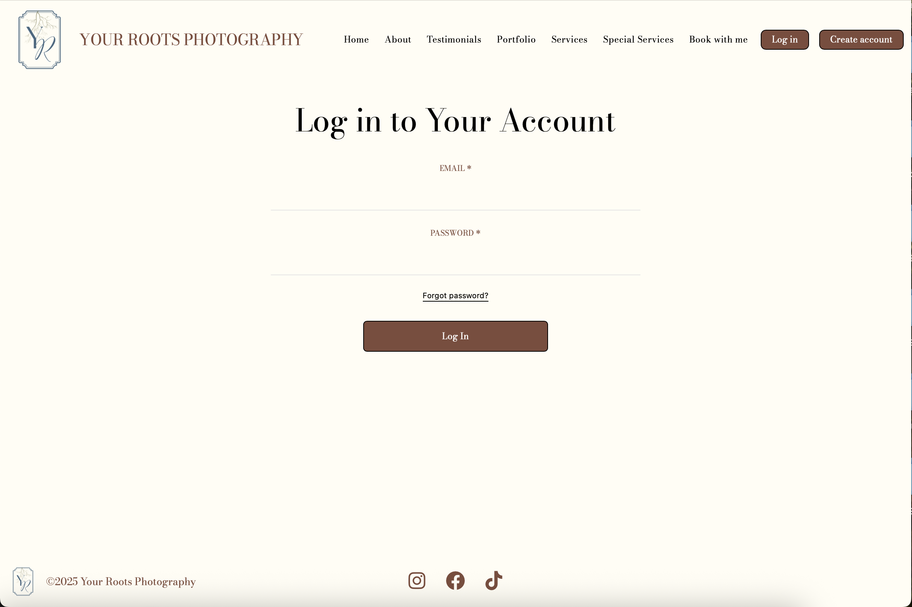
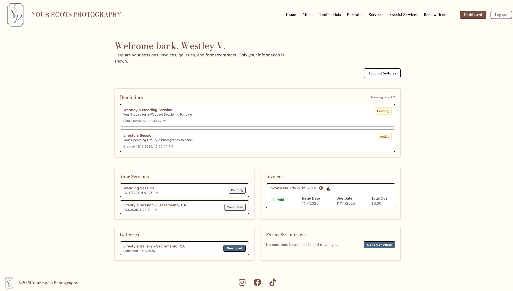
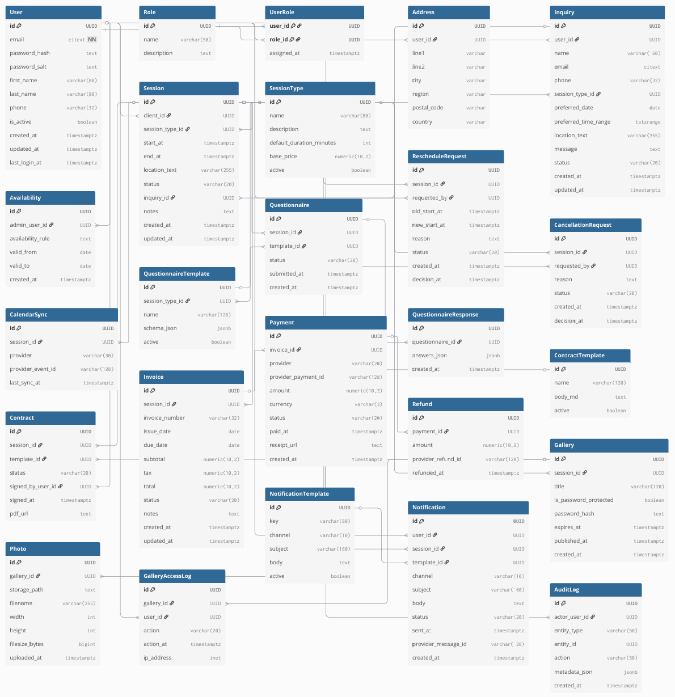

<!-- Improved compatibility of back to top link: See: https://github.com/othneildrew/Best-README-Template/pull/73 -->

<!--
*** Thanks for checking out the Best-README-Template. If you have a suggestion
*** that would make this better, please fork the repo and create a pull request
*** or simply open an issue with the tag "enhancement".
*** Don't forget to give the project a star!
*** Thanks again! Now go create something AMAZING! :D
-->

<!-- PROJECT SHIELDS -->
<!--
*** I'm using markdown "reference style" links for readability.
*** Reference links are enclosed in brackets [ ] instead of parentheses ( ).
*** See the bottom of this document for the declaration of the reference variables
*** for contributors-url, forks-url, etc. This is an optional, concise syntax you may use.
*** https://www.markdownguide.org/basic-syntax/#reference-style-links
-->
[![Contributors][contributors-shield]][contributors-url]

> Your Roots Photography is powered by a custom Photography Business Management System (PBMS)

<!-- PROJECT LOGO -->
 

  

<h1 align="center">Your Roots Photography</h1>

  

    <a href="https://github.com/wesbruh/PBMS"><strong>Explore the docs »</strong></a>
     
      
  

<!-- TABLE OF CONTENTS -->

  
Table of Contents

  <ol>
    <li>
      <a href="#about-the-project">About The Project</a>
      <ul>
        <li><a href="#built-with">Built With</a></li>
        <li><a href="#technologies-and-collaborative-tools">Technologies and Collaborative Tools</a></li>
      </ul>
    </li>
    <li><a href="#CSC-191-roadmap">CSC 191 Roadmap</a></li>
    <ul>
        <li><a href="#developer-instructions">Developer Instructions</a></li>
        <li><a href="#testing">Testing</a></li>
        <li><a href="#deployment">Deployment</a></li>
      </ul>
    <li><a href="#contact">Contact</a>
    <ul>
        <li><a href="#project-members">Project Members</a></li></li>
        </li>
      </ul></li>
  </ol>

<!-- SYNOPSIS -->
# About The Project 
The Photography Business Management System (PBMS) is a full-stack web platform built for our client, Bailey White of Your Roots Photography. The system streamlines the entire client experience by allowing users to create accounts, schedule photography sessions, submit inquiries, make secure payments, and access their final galleries. On the admin side, the platform provides an intuitive dashboard for managing clients, bookings, invoices, contracts, galleries, and notifications all in one place.

This project was developed as part of the Senior Capstone sequence (CSC 190/191) at California State University, Sacramento.

  

(<a href="#readme-top">back to top</a>)

<!-- BACKGROUND  -->

# Background

Your Roots Photography is a modern photography brand based in Northern California that is dedicated to capturing real, emotional, and artistic imagery. With a focus on lifestyle, wedding, and maternity photography, the business combines a documentary approach with creative editing to produce stunning visuals that clients can treasure for years. The brand's mission is to create an effortless client experience, from booking to final gallery delivery completely. The business emphasizes professionalism, creativity, and strong client relationships. However, all of these tasks are being completed manually and by just one person. 

Our team recognized the need for a centralized, automated platform that would streamline these processes. 

* Client dashboard
* Automated invoice generation
* Online galleries
* Contract management
* Notifications and reminders
* Secure session tracking

### Using a modern full-stack architecture:

 [![Vite]][Vite-url]
 [![React]][React-url]
 [![Tailwind]][Tailwind-url]
 [![Supabase]][Supabase-url]
 [![Node.js]][Node.js-url]
 [![Express.js]][Express-url]  

 ### and collaborative tools such as:

 [![vscode]][vscode-url]
 [![Jira]][Jira-url]
 [![Figma]][Figma-url]
 [![Discord]][Discord-url]

Your Roots Photography allows users to create an account and log in to securely access their personal dashboard and content.  

  

The Client Dashboard offers users a clean, organized, and personalized overview of all their photography-related information.

  

(<a href="#readme-top">back to top</a>)

# Entity Relationship Diagram

Below is the Entity Relationship Diagram (ERD) that defines the data structure for the Photography Business Management System.

This diagram outlines the relationships between key components such as clients, sessions, invoices, payments, galleries, and forms.

  

(<a href="#readme-top">back to top</a>)

<!-- CSC 191 ROADMAP -->
# CSC 191 Roadmap

Based on the current state of the project, a general timeline for functionalities to be developed during CSC 191 include  

### Sprint 5 (Jan 25 - Feb 7)
- Integrate role-based access to secure role-specific dashboards
- Create/update all admin UI and have it match previous for consistency

### Sprint 6 (Feb 8 - Feb 21)
- Implement inquiry review functionality
- Develop customizable questionnaire functionality
- Generate an audit log of notifications for admin to view

### Sprint 7 (Feb 22 - Mar 7)
- Create dynamic calendar for admin
- Implement session scheduling functionality
- Develop Contacts viewing to show per-client information 

### Sprint 8 (Mar 8 - Mar 22)
- Implement gallery upload, generation, and publishing, with additional (optional) password protection
- Incorporate gallery previews on client's side
- Create analytical reports for business transactions

### Sprint 9 (Mar 23 - April 5)
- Integrate a trusted and secure third-party payment service to handle transactions
- Design and display updated portfolio
- Generate thank-you responses and photo-delivery reminders
- Ensure notifications are sent per task assigned to each user

(<a href="#readme-top">back to top</a>)

<!-- DEVELOPER INSTRUCTIONS -->
## DEVELOPER INSTRUCTIONS

Placeholder, will be done in CSC 191.

(<a href="#readme-top">back to top</a>)

<!-- TESTING -->
## TESTING

Placeholder, will be done in CSC 191.

(<a href="#readme-top">back to top</a>)

<!-- DEPLOYMENT -->
## DEPLOYMENT

Placeholder, will be done in CSC 191

(<a href="#readme-top">back to top</a>)

<!-- UNIVERSITY/TEAM MEMBER CONTACT -->
# Contact

  

<h3 align="center"> College of Engineering and Computer Science
 
California State University, Sacramento
 
California State University, Sacramento
6000 J Street, Sacramento, CA 95819
 
Campus Main Phone: (916) 278-6011
 
<a href="https://www.csus.edu/college/engineering-computer-science/computer-science/">Computer Science Department</a>
</h3>

## Project Members:

Westley Valentin - wvalentin@csus.edu  
Munir Omar - muniromar@csus.edu  
Erds Mabilog - emabilog@csus.edu  
Luis De Santiago - lpdesantiago@csus.edu  
Ritchie Martinez - ritchiemartinez@csus.edu  
Frank Kutsar - fkutsar@csus.edu  
Abhijit Singh Ubhi - abhijitsinghubhi@csus.edu  
Gaurav Shergill - gauravshergill@csus.edu  

#### Project Link: [PBMS](https://github.com/wesbruh/PBMS)

(<a href="#readme-top">back to top</a>)

<!-- MARKDOWN LINKS & IMAGES -->
<!-- https://www.markdownguide.org/basic-syntax/#reference-style-links -->
[contributors-shield]: https://img.shields.io/github/contributors/wesbruh/PBMS.svg?style=for-the-badge
[contributors-url]: https://github.com/wesbruh/PBMS/graphs/contributors
[forks-shield]: https://img.shields.io/github/forks/wesbruh/PBMS.svg?style=for-the-badge

[product-screenshot]: images/screenshot.png

<!-- Shields.io badges. You can a comprehensive list with many more badges at: https://github.com/inttter/md-badges -->
[Vite]: https://img.shields.io/badge/Vite-646CFF?logo=vite&logoColor=fff
[Vite-url]: https://vite.dev/

[React]: https://img.shields.io/badge/React-%2320232a.svg?logo=react&logoColor=%2361DAFB
[React-url]: https://reactjs.org/

[Tailwind]: https://img.shields.io/badge/Tailwind%20CSS-%2338B2AC.svg?logo=tailwind-css&logoColor=white
[Tailwind-url]: https://tailwindcss.com/

[Supabase]: https://img.shields.io/badge/Supabase-3FCF8E?logo=supabase&logoColor=fff
[Supabase-url]: https://supabase.com/

[Node.js]: https://img.shields.io/badge/Node.js-6DA55F?logo=node.js&logoColor=white
[Node.js-url]: https://nodejs.org/en

[vscode]: https://custom-icon-badges.demolab.com/badge/Visual%20Studio%20Code-0078d7.svg?logo=vsc&logoColor=white
[vscode-url]: https://code.visualstudio.com/

[Jira]: https://img.shields.io/badge/Jira-0052CC?logo=jira&logoColor=fff
[Jira-url]: https://www.atlassian.com/software/jira

[Figma]: https://img.shields.io/badge/Figma-F24E1E?logo=figma&logoColor=white
[Figma-url]: https://www.figma.com/

[Discord]: https://img.shields.io/badge/Discord-%235865F2.svg?&logo=discord&logoColor=white
[Discord-url]: https://discord.com/

[Express.js]: https://img.shields.io/badge/Express.js-%23404d59.svg?logo=express&logoColor=%2361DAFB
[Express-url]: https://expressjs.com/ 