<a id="readme-top"></a>

<!-- PROJECT SHIELDS -->
<!--
*** I'm using markdown "reference style" links for readability.
*** Reference links are enclosed in brackets [ ] instead of parentheses ( ).
*** See the bottom of this document for the declaration of the reference variables
*** for contributors-url, forks-url, etc. This is an optional, concise syntax you may use
*** https://www.markdownguide.org/basic-syntax/#reference-style-links
-->
[![Contributors][contributors-shield]][contributors-url]&emsp;[](https://github.com/wesbruh/PBMS/actions/workflows/deploy.yml)

> Your Roots Photography is powered by a custom **Photography Business Management System (PBMS)**.

<!-- PROJECT LOGO -->
<br />
<div align="center">
  <a href="https://github.com/wesbruh/PBMS">
    
  </a>

<h1 align="center">Your Roots Photography</h1>


  <p align="center">
    <a href="https://github.com/wesbruh/PBMS"><strong>Explore the docs »</strong></a>
    <br />
    <br /> 
  </p>
</div>


<!-- TABLE OF CONTENTS -->
<details>
  <summary>Table of Contents</summary>
  <ol>
    <li><a href="#about-the-project">About The Project</a></li>
    <li><a href="#background">Background</a></li>
    <li><a href="#screenshots">Screenshots</a>
    <li><a href="#entity-relationship-diagram">Entity Relationship Diagram</a></li>
    <li><a href="#built-with">Built With</a></li>
    <li>
      <a href="#developer-instructions">Developer Instructions</a>
    <ul>
      <li><a href="#prerequisites">Prerequisites</a></li>
      <li><a href="#installation">Installation</a></li>
      <li><a href="#environment-variables">Environment Variables</a></li>
      <li><a href="#running-the-application">Running The Application</a></li>
      </ul>
    </li>
    <li><a href="#testing">Testing</a></li>
    <li><a href="#deployment">Deployment</a></li>
    <li><a href="#contact">Contact</a>
    <ul>
      <li><a href="#project-members">Project Members</a></li>
      </ul>
    </li>
  </ol>
</details>


<!-- SYNOPSIS -->
# About The Project 
The Photography Business Management System (PBMS) is a full-stack web platform built for our client, Bailey White of Your Roots Photography. The system streamlines the entire client experience by allowing users to create accounts, schedule photography sessions, submit inquiries, make secure payments, and access their final galleries. On the admin side, the platform provides an intuitive dashboard for managing clients, bookings, invoices, contracts, galleries, and notifications all in one place.

The application was created because Bailey was managing all of these tasks manually and as a solo business owner. Booking sessions, sending invoices, delivering galleries, and tracking payments were all handled through separate tools or by hand. Our team recognized the need for a centralized, automated platform that would consolidate these workflows into a single system, reduce administrative overhead, and provide a more professional experience for her clients.

This project was developed as part of the Senior Capstone sequence (CSC 190/191) at California State University, Sacramento.


<p align="right">(<a href="#readme-top">back to top</a>)</p>


<!-- BACKGROUND  -->

# Background

Your Roots Photography is a modern photography brand based in Northern California that is dedicated to capturing real, emotional, and artistic imagery. With a focus on lifestyle, wedding, and maternity photography, the business combines a documentary approach with creative editing to produce stunning visuals that clients can treasure for years. The brand's mission is to create an effortless client experience, from booking to final gallery delivery completely. The business emphasizes professionalism, creativity, and strong client relationships.

Our team recognized the need for a centralized, automated platform that would streamline these processes. 

* Client dashboard - overview of all their photography-related information
* Booking Requests
* Admin dashboard:
  * Automated invoice generation
  * Uploadable online gallery delivery
  * Contract and Questionnaire management
  * Notifications and reminders
  * Secure session tracking
  * Business analytics

<!--- SCREENSHOTS --->
# Screenshots
### Landing Page
The home page introduces Your Roots Photography and highlights key services such as weddings, engagements, family portraits, and lifestyle shoots.

<div align="center">
  
  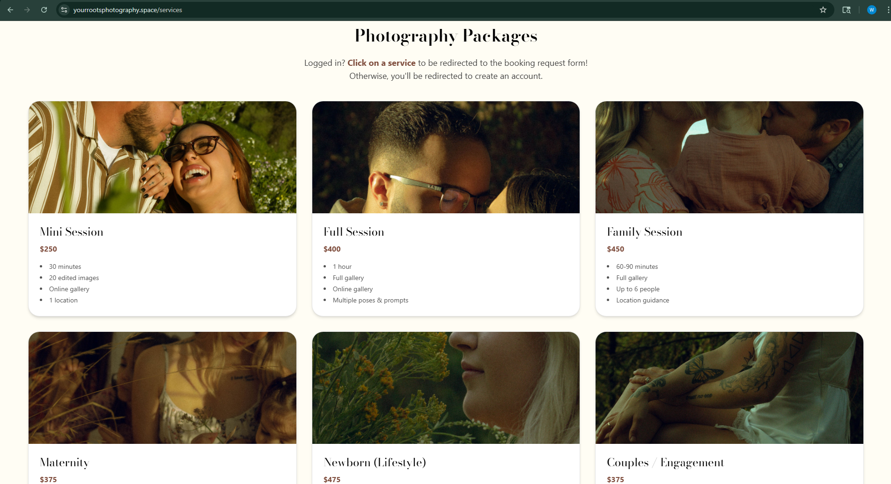
</div>

### Login Page
Users can create an account and log in to securely access their personal dashboard and content.

<div align="center">
  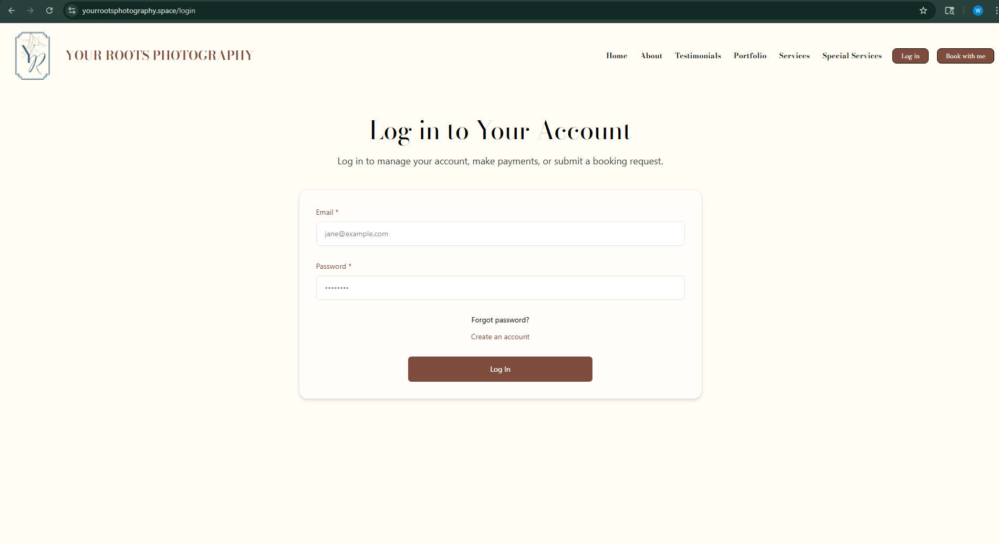
</div>

### Booking Request (Inquiry Form)
Clients can submit a booking request through the inquiry form by providing their name, contact information, desired session type, preferred date and location, and any special requests. Available dates are dynamically generated based on the photographer's current availability. To submit an inquiry for the first time, an account must be created by the user first.

<div align="center">
  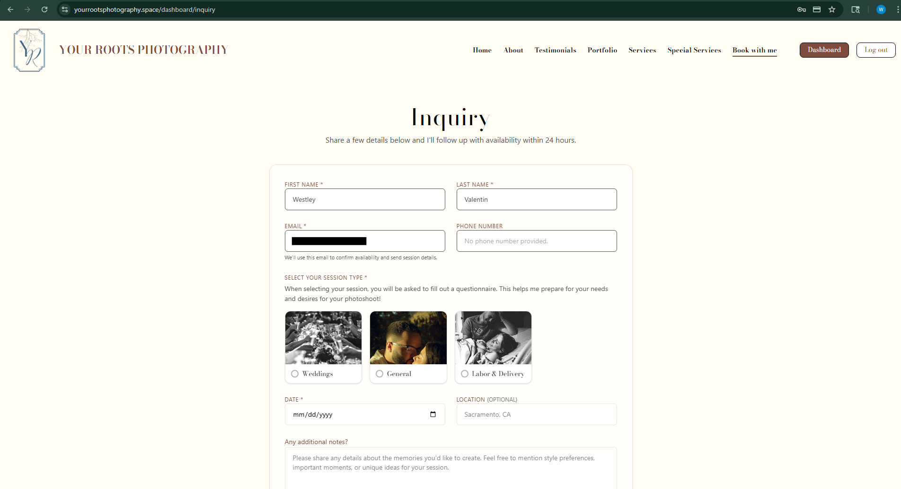
  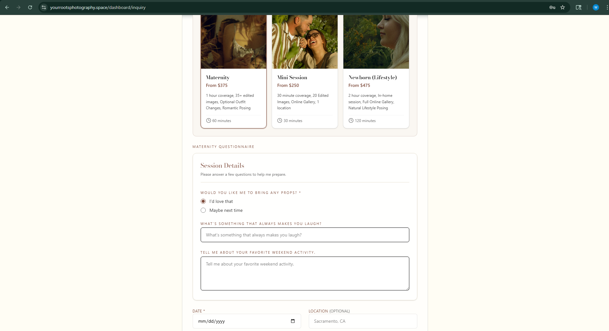
  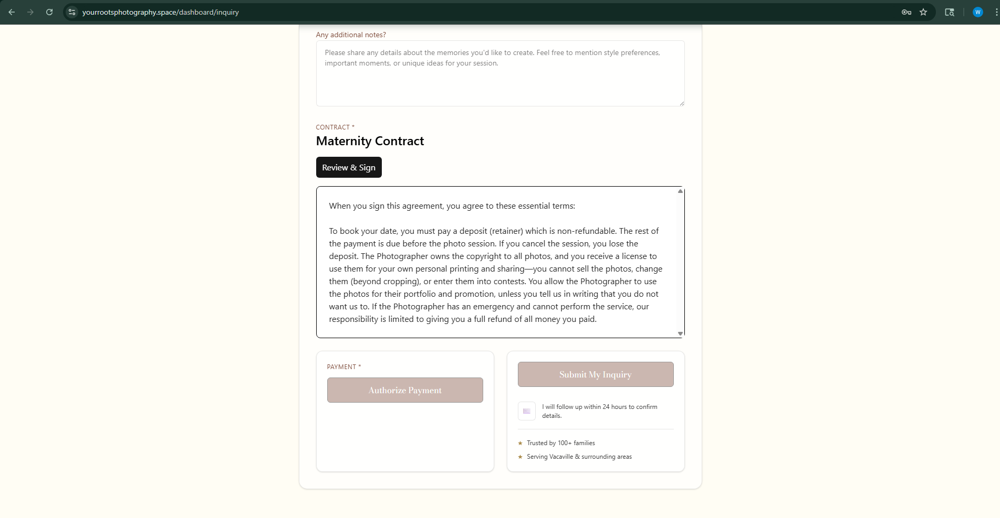
</div>

### Client Dashboard
The Client Dashboard offers users a clean, organized, and personalized overview of all their photography-related information including upcoming sessions, invoices, galleries, and notifications.

<div align="center">
  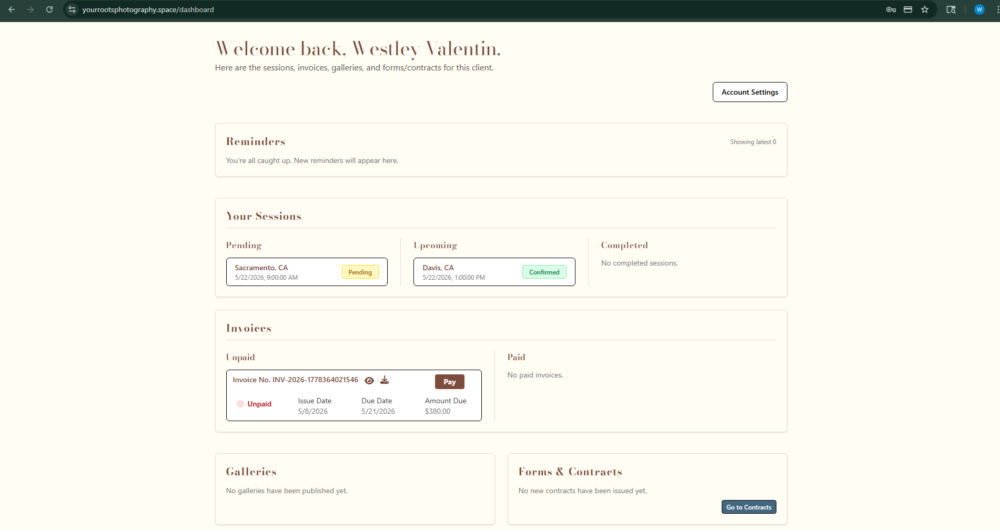
</div>

### Admin Dashboard
The Admin Dashboard gives the photographer full control over all business operations. From here, the admin can view business analytics, view and manage pending client bookings, upload photo galleries, create and download/send invoices, and manage pre-session questionnaires and contracts, all from a single centralized interface.

<div align="center">
  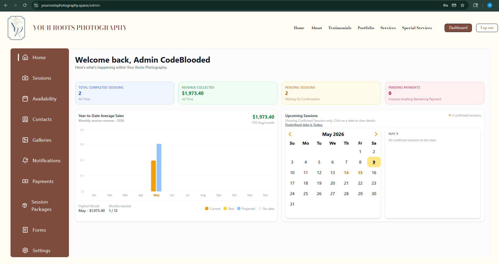
  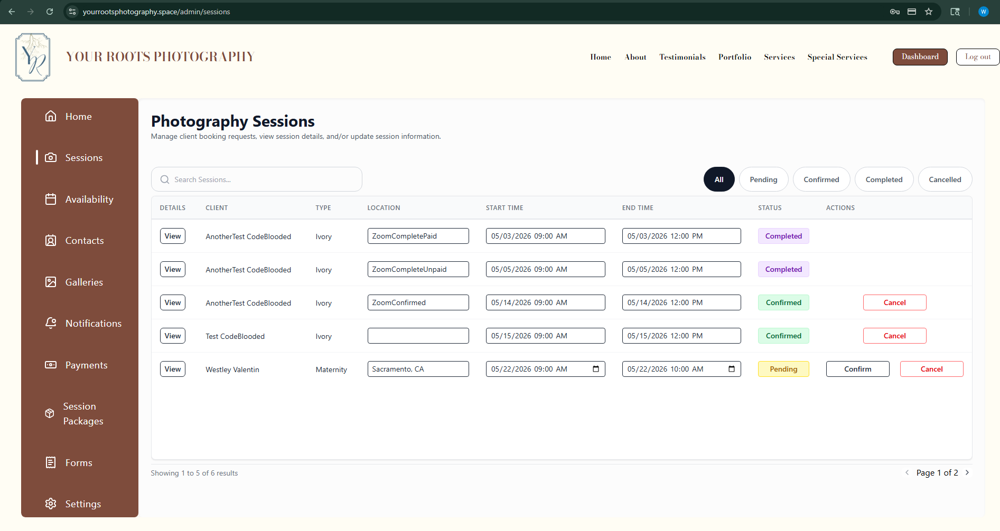
  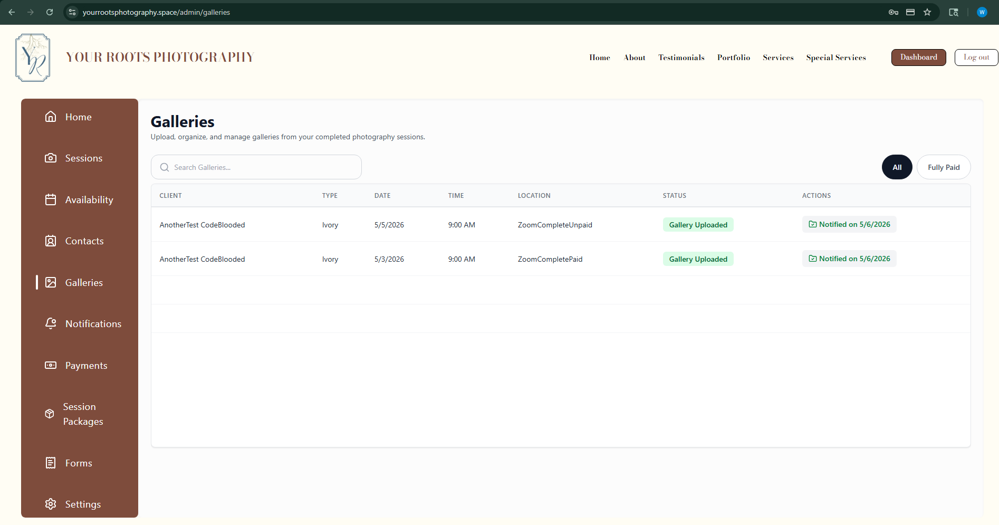
  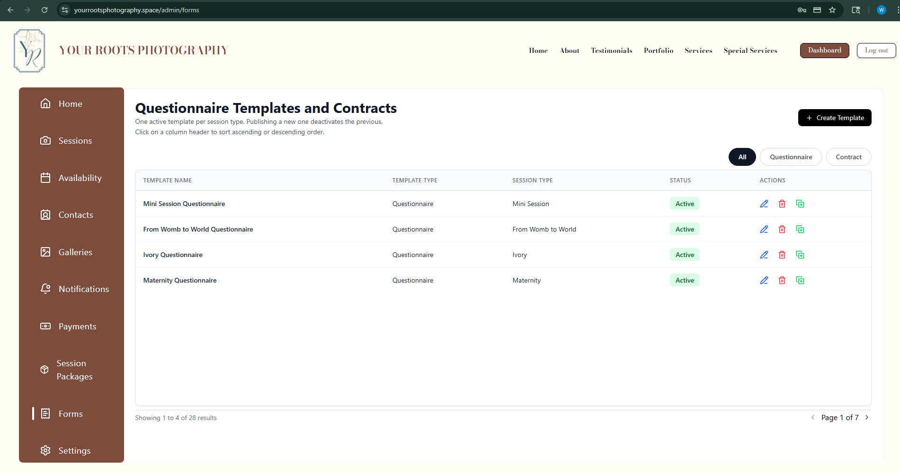
</div>


<p align="right">(<a href="#readme-top">back to top</a>)</p>


<!--- ERD --->
# Entity Relationship Diagram

Below is the Entity Relationship Diagram (ERD) that defines the data structure for the Photography Business Management System.

This diagram outlines the relationships between key components such as clients, sessions, invoices, payments, galleries, and questionnaires/contract forms.

<div align="center">
  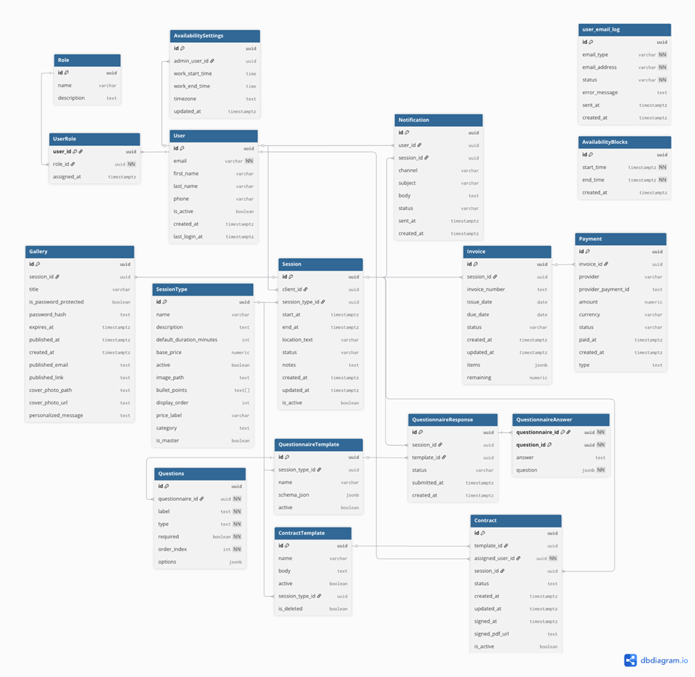
</div>

<p align="right">(<a href="#readme-top">back to top</a>)</p>

<!--- BUILT WITH --->
# Built With
### Using a modern full-stack architecture:

 [![Vite]][Vite-url]
 [![React]][React-url]
 [![Tailwind]][Tailwind-url]
 [![Supabase]][Supabase-url]
 [![Node.js]][Node.js-url]
 [![Express.js]][Express-url]
 [![npm]][npm-url]
 [![Stripe]][Stripe-url]
 [![Resend]][Resend-url]
 [![Hostinger]][Hostinger-url]
 [![Render]][Render-url]
 [![GitHub Actions]][GitHubActions-url] 
  

### and collaborative tools such as:

 [![vscode]][vscode-url]
 [![Jira]][Jira-url]
 [![Figma]][Figma-url]
 [![Canva]][Canva-url]
 [![Discord]][Discord-url]
 [![Canvas]][Canvas-url]
 [![Zoom]][Zoom-url]

<p align="right">(<a href="#readme-top">back to top</a>)</p>

<!-- DEVELOPER INSTRUCTIONS -->
# DEVELOPER INSTRUCTIONS
## Getting Started 
Follow these instructions to get a local copy of the project up and running on your machine. Addtionally, more information can be found  in the entirety of the **Maintenance Manual, and including Sections 3.5, 3.6 and Section 6: Database**.
 
## Prerequisites

- **Node.js** v24 or higher - [Download here](https://nodejs.org/)
- **npm** (comes with Node.js)
- A **Supabase** project - [Create one here](https://supabase.com/)
- A **Stripe** account (for payment processing) - [Sign up here](https://stripe.com/)
- A **Resend** account (for transactional emails) - [Sign up here](https://resend.com/)

## Installation
 
1. Clone the repository:
   ```sh
   git clone https://github.com/wesbruh/PBMS.git
   cd PBMS
   ```
 
2. Install frontend dependencies:
   ```sh
   npm ci
   ```
 
3. Install backend dependencies:
   ```sh
   cd backend
   npm ci
   cd ..
   ```
   
## Environment Variables
 
The application requires environment variables for both the frontend and backend. Create `.env` files in the appropriate directories using the examples below.
 
**Frontend** (root `.env`):
```
VITE_API_URL=http://localhost:<backend_port>
VITE_SUPABASE_URL=<your_supabase_project_url>
VITE_SUPABASE_ANON_KEY=<your_supabase_anon_key>
```
 
**Backend** (`backend/.env`):
```
PORT=<your_backend_port>
CLIENT_BASE_URL=http://localhost:5173
SUPABASE_URL=<your_supabase_project_url>
SUPABASE_SERVICE_ROLE_KEY=<your_supabase_service_role_key>
STRIPE_API_KEY=<your_stripe_secret_key>
RESEND_API_KEY=<your_resend_api_key>
```
 
> 	:warning: **Never commit `.env` files to GitHub.** They contain secrets that should remain local.

## Running the Application
 
1. Start the backend server:
   ```sh
   cd backend
   npm start
   ```
 
2. In a separate terminal, start the frontend dev server:
   ```sh
   npm run dev
   ```
 
3. Open your browser and navigate to `http://localhost:5173`.

<p align="right">(<a href="#readme-top">back to top</a>)</p>

<!-- TESTING -->
## TESTING
To test any new changes made to the application and help prevent regressions, run the local test suite before pushing code changes to the repository. This helps ensure that new changes do not affect existing functionality.

To run all tests with coverage enabled, use the following command:

```sh
npm test -- --coverage
```

To run a specific test file with coverage enabled, use the following command:

```sh
npm test <test_file_path> -- --coverage
```

For example, to run the existing `SessionTypesMainPage.test.js` test file located in `tests/unit/frontend`, use the following command:

```sh
npm test tests/unit/frontend/SessionTypesMainPage.test.js -- --coverage
```

Additionally, below are the scripts available to run specific tests:
| Command | Description |
|---|---|
| `npm run test` | Runs all tests |
| `npm run test:unit` | Runs all unit tests in `tests/unit` |
| `npm run test:frontend` | Runs all unit tests in `tests/frontend` |
| `npm run test:backend` | Runs backend unit tests in `tests/backend`, including integration tests and e2e tests |
| `npm run edge:test` | Runs Deno test for edge function transactional emails |

<p align="right">(<a href="#readme-top">back to top</a>)</p>

<!-- DEPLOYMENT -->
## DEPLOYMENT
The PBMS application is deployed using a CI/CD pipeline that connects GitHub, GitHub Actions, and Render.
### How It Works

1. A developer pushes code to the `main` branch or merges a pull request.
2. GitHub Actions runs the workflow defined in `.github/workflows/deploy.yml`, which executes lint, frontend tests, backend tests, and a build step.
3. If all checks pass and the trigger was a push to `main`, the deploy job authenticates with the Render API using secrets stored in the GitHub `Render` environment and triggers deployment for both services.
4. Render pulls the latest code, builds, and publishes the backend Web Service and frontend Static Site.
> Auto-deploy on Render is set to **Off**. All deployments are initiated exclusively through the GitHub Actions workflow to ensure no untested code reaches production.

### Production Services
| Service | Type | URL |
|---|---|---|
| Frontend | Static Site (CDN) | [yourrootsphotography.space](https://www.yourrootsphotography.space) |
| Backend | Web Service | [Render Web Service (internal API)](https://dashboard.render.com/login) | 
| Database | PostgreSQL + Auth | [Supabase](https://supabase.com/dashboard/sign-in) |
| Payments | Payment Processing | [Stripe](https://dashboard.stripe.com/login) |
| Email | Transactional Emails | [Resend](https://resend.com/login) + Supabase Edge Functions |

### Manual Deployment
If you need to re-deploy without pushing new code (for example, after updating an environment variable on Render):

1. Go to the GitHub repository and click the **Actions** tab.
2. Select the **CI/CD GitHub Actions Deploy & Tests Workflow for PBMS** workflow.
3. Click **Run Workflow**, select the `main` branch, then click **Run Workflow** again. 

For full deployment documentation including Render Service Configuration, environment variable details, CORS setup, and Supabase redirect URLs, see the **Maintenance Manual - Section 4: Deployment**.

<p align="right">(<a href="#readme-top">back to top</a>)</p>

<!-- UNIVERSITY/TEAM MEMBER CONTACT -->
# Contact
### Project Members
<p align="left"> 
Westley Valentin - <a href="mailto:wvalentin@csus.edu">wvalentin@csus.edu</a>&emsp;&emsp;&emsp;&emsp;&emsp;&ensp;&nbsp;Erds Mabilog - <a href="mailto:emabilog@csus.edu">emabilog@csus.edu</a>
<br>
Luis De Santiago - <a href="mailto:lpdesantiago@csus.edu">lpdesantiago@csus.edu</a>&emsp;&emsp;&emsp;&emsp;Munir Omar - <a href="mailto:muniromar@csus.edu">muniromar@csus.edu</a>
<br>
Ritchie Martinez - <a href="mailto:ritchiemartinez@csus.edu">ritchiemartinez@csus.edu</a>&emsp;&emsp;&emsp;&ensp;Frank Kutsar - <a href="mailto:fkutsar@csus.edu">fkutsar@csus.edu</a>
<br>
Abhijit Singh Ubhi - <a href="mailto:abhijitsinghubhi@csus.edu">abhijitsinghubhi@csus.edu</a>&emsp;&emsp;Gaurav Shergill - <a href="mailto:gauravshergill@csus.edu">gauravshergill@csus.edu</a>
<br>
<br>
</p>

<div align="center">
  
  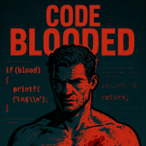
</div>

<h3 align="center"> College of Engineering and Computer Science
<br>
California State University, Sacramento
<br>
6000 J Street, Sacramento, CA 95819
<br>
Campus Main Phone: (916) 278-6011
<br>
<a href="https://www.csus.edu/college/engineering-computer-science/computer-science/">Computer Science Department</a> 
</h3>

#### Project Link: [PBMS](https://github.com/wesbruh/PBMS)
<p align="right">(<a href="#readme-top">back to top</a>)</p>


<!-- MARKDOWN LINKS & IMAGES -->
<!-- https://www.markdownguide.org/basic-syntax/#reference-style-links -->
[contributors-shield]: https://img.shields.io/github/contributors/wesbruh/PBMS.svg
[contributors-url]: https://github.com/wesbruh/PBMS/graphs/contributors
[forks-shield]: https://img.shields.io/github/forks/wesbruh/PBMS.svg?style=for-the-badge

[product-screenshot]: images/screenshot.png

<!-- Shields.io badges. Found at: https://github.com/inttter/md-badges -->
[Vite]: https://img.shields.io/badge/Vite-646CFF?logo=vite&logoColor=fff
[Vite-url]: https://vite.dev/

[React]: https://img.shields.io/badge/React-%2320232a.svg?logo=react&logoColor=%2361DAFB
[React-url]: https://reactjs.org/

[Tailwind]: https://img.shields.io/badge/Tailwind%20CSS-%2338B2AC.svg?logo=tailwind-css&logoColor=white
[Tailwind-url]: https://tailwindcss.com/

[Supabase]: https://img.shields.io/badge/Supabase-3FCF8E?logo=supabase&logoColor=fff
[Supabase-url]: https://supabase.com/

[Node.js]: https://img.shields.io/badge/Node.js-6DA55F?logo=node.js&logoColor=white
[Node.js-url]: https://nodejs.org/en

[vscode]: https://custom-icon-badges.demolab.com/badge/Visual%20Studio%20Code-0078d7.svg?logo=vsc&logoColor=white
[vscode-url]: https://code.visualstudio.com/

[Jira]: https://img.shields.io/badge/Jira-0052CC?logo=jira&logoColor=fff
[Jira-url]: https://www.atlassian.com/software/jira

[Figma]: https://img.shields.io/badge/Figma-F24E1E?logo=figma&logoColor=white
[Figma-url]: https://www.figma.com/

[Discord]: https://img.shields.io/badge/Discord-%235865F2.svg?&logo=discord&logoColor=white
[Discord-url]: https://discord.com/

[Express.js]: https://img.shields.io/badge/Express.js-%23404d59.svg?logo=express&logoColor=%2361DAFB
[Express-url]: https://expressjs.com/ 

[npm]: https://img.shields.io/badge/npm-CB3837?logo=npm&logoColor=fff
[npm-url]: https://www.npmjs.com/

[Stripe]: https://img.shields.io/badge/Stripe-5851DD?logo=stripe&logoColor=fff
[Stripe-url]: https://stripe.com/

[Resend]: https://img.shields.io/badge/Resend-000000?logo=resend&logoSize=auto
[Resend-url]: https://resend.com/home

[Hostinger]: https://img.shields.io/badge/Hostinger-673DE6?logo=hostinger&logoColor=fff
[Hostinger-url]: https://www.hostinger.com/

[Render]: https://img.shields.io/badge/Render-46E3B7?logo=render&logoColor=000
[Render-url]: https://render.com/

[GitHub Actions]: https://img.shields.io/badge/GitHub_Actions-2088FF?logo=github-actions&logoColor=white
[GitHubActions-url]: https://github.com/features/actions

[Canva]: https://custom-icon-badges.demolab.com/badge/Canva-%2300C4CC.svg?&logo=canva&logoColor=white
[Canva-url]: https://www.canva.com/

[Canvas]: https://img.shields.io/badge/Canvas-E72429?logo=canvas
[Canvas-url]: https://www.instructure.com/

[Zoom]: https://img.shields.io/badge/Zoom-2D8CFF?logo=zoom&logoColor=white
[Zoom-url]: https://www.zoom.com/
